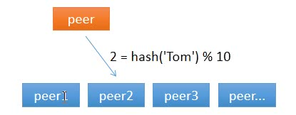
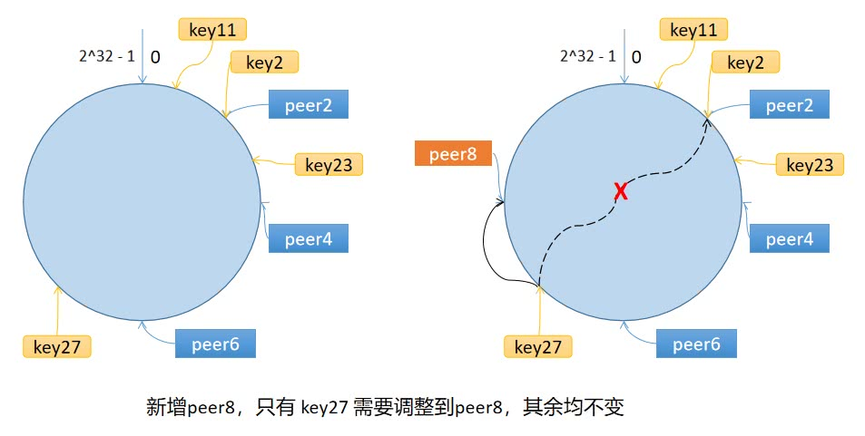

# 一致性哈希

## 1. 为什么使用一致性哈希

致性哈希算法是 LemonCache 从单节点走向分布式节点的一个重要的环节。那你可能要问了，

### 1.1 我该访问谁？

对于分布式缓存来说，当一个节点接收到请求，如果该节点并没有存储缓存值，那么它面临的难题是，从谁那获取数据？自己，还是节点1, 2, 3, 4… 。假设包括自己在内一共有 10 个节点，当一个节点接收到请求时，随机选择一个节点，由该节点从数据源获取数据。

假设第一次随机选取了节点 1 ，节点 1 从数据源获取到数据的同时缓存该数据；那第二次，只有 1/10 的可能性再次选择节点 1, 有 9/10 的概率选择了其他节点，如果选择了其他节点，就意味着需要再一次从数据源获取数据，一般来说，这个操作是很耗时的。这样做，一是缓存效率低，二是各个节点上存储着相同的数据，浪费了大量的存储空间。

有什么办法可以让给定的key,每次都选择同一个节点,使用哈希算法可以实现,比如把key的每个字符的ASCII码
加起来,然后除以十取余数,余数范围是0~9,刚好对应十台机器,这是一个自定义哈希

从上图可以看到,任意一个节点任意时刻请求查找键 Tom 对应的值，都会分配给节点 2，有效地解决了上述的问题。

### 1.2 节点数量变化了怎么办？

简单求取哈希解决了性能问题,但是没有考虑节点数量变化的场景,假设,移除了一个节点,剩下九个节点,
那么之前 hash(key) % 10 变成了 hash(key) % 9,也就意味着几乎缓存值对应的节点都发生了改变。即几乎所有的缓存值都失效了。节点在接收到对应的请求时，均需要重新去数据源获取数据，容易引起 缓存雪崩。

``
缓存雪崩：缓存在同一时刻全部失效，造成瞬时DB请求量大、压力骤增，引起雪崩。常因为缓存服务器宕机，或缓存设置了相同的过期时间引起。
``

那如何解决这个问题呢？一致性哈希算法可以。

## 2 算法原理

### 2.1 步骤

一致性哈希算法将 key 映射到 2^32 的空间中，将这个数字首尾相连，形成一个环

- 计算节点/机器(通常使用节点的名称、编号和 IP 地址)的哈希值，放置在环上。
- 计算 key 的哈希值，放置在环上，顺时针寻找到的第一个节点，就是应选取的节点/机器。

环上有 peer2,peer4,peer6 三个节点,key11,key2,key27,均映射到peer2,key23 映射到peer4.此时,假设新增节点/机器peer8,假设新增的位置如图所示,那么只有 key27 从 peer2 调整到 peer8，其余的映射均没有发生改变。

### 2.2 数据倾斜问题

如果服务器的节点过少，容易引起 key 的倾斜。例如上面例子中的 peer2，peer4，peer6 分布在环的上半部分，下半部分是空的。那么映射到环下半部分的 key 都会被分配给 peer2，key 过度向 peer2 倾斜，缓存节点间负载不均。

为了解决这个问题，引入了虚拟节点的概念，一个真实节点对应多个虚拟节点。

假设 1 个真实节点对应 3 个虚拟节点，那么 peer1 对应的虚拟节点是 peer1-1、 peer1-2、 peer1-3（通常以添加编号的方式实现），其余节点也以相同的方式操作。

- 第一步，计算虚拟节点的 Hash 值，放置在环上。
- 第二步，计算 key 的 Hash 值，在环上顺时针寻找到应选取的虚拟节点，例如是 peer2-1，那么就对应真实节点 peer2

虚拟节点扩充了节点的数量，解决了节点较少的情况下数据容易倾斜的问题。而且代价非常小，只需要增加一个字典(map)维护真实节点与虚拟节点的映射关系即可。
